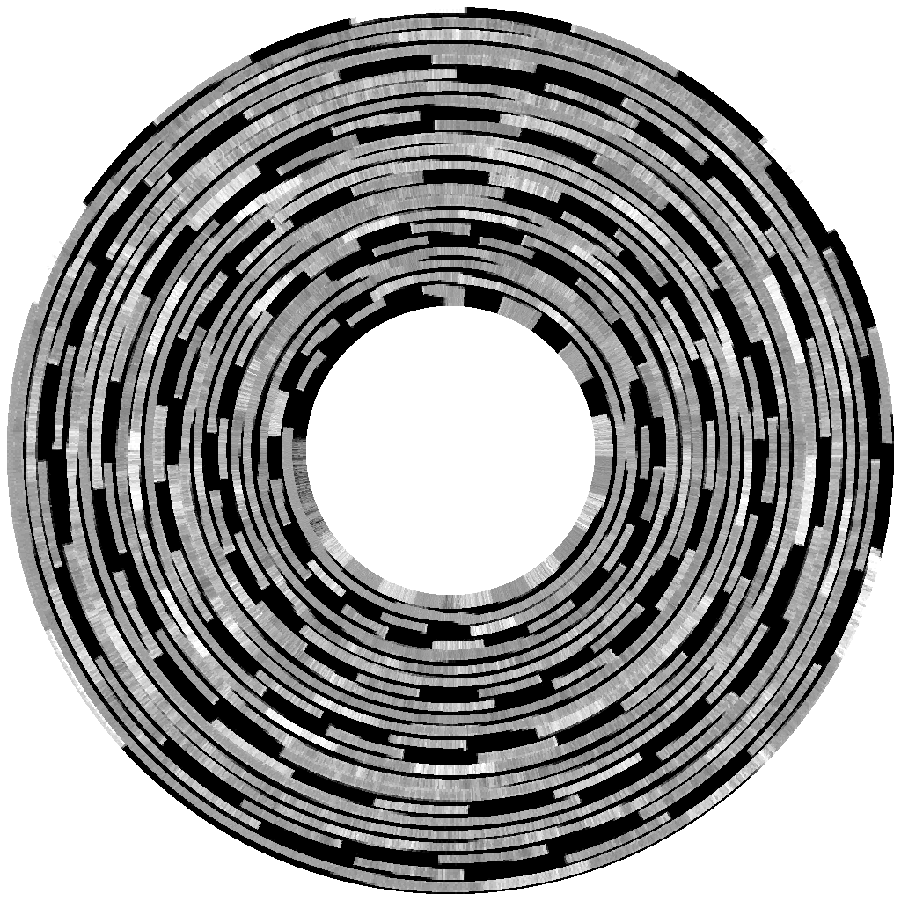
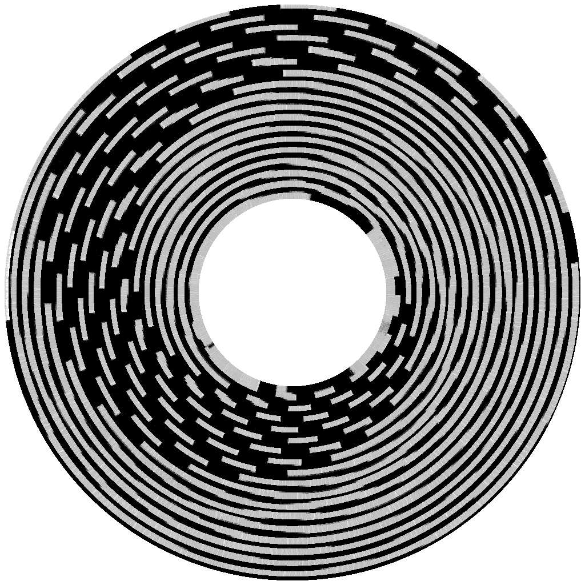

# Turntable: the world's crappiest record player

Streaming audio from a 5.25" floppy disk on an Apple II.

## Background

The Disk II and Apple II speaker are both exposed to the CPU as very low level hardware interfaces.

- Producing recognizable speaker audio requires toggling the speaker at precise timing intervals.

- Reading/writing a byte from the Disk II, and controlling the positioning of the read/write head, also require precise CPU timing.

Can we do all 3 at the same time?  Yes we can!  Barely.

## Why?

This project was done as a "slackfest" entry during KansasFest 2023.  I'd had the idea kicking around in my head for a few years previously as something that seemed like it should be on the edge of possible, which is the kind of technical challenge I enjoy about the Apple II.  I also wanted to learn how the Disk II hardware worked at a more basic level, which is the other kind of technical challenge I enjoy.

## Requirements

Apart from the technical challenges of playing back audio from a 5.25" floppy disk, we also need to get data onto disk in the first place.

As discussed below, I cheat by using a RamFactor ("Slinky"-style) memory card to pre-stage the data, since this allows efficient reading from memory while writing the data stream to disk.

That makes this project (even more) impractical, because not only do you need to have this (relatively uncommon) Apple II hardware in order to prepare a disk image, if you have one then you can already stream audio for longer and at a much higher quality by preloading it into the memory card.

Let's agree to gloss over the silliness of reading audio data into memory, only to write it to disk and play back a lower quality version.  The aim of this project was to see what could be done, ignoring what is actually practical or useful :-)

At the time I started this project no emulators supported the terrible things I was doing to disk layout. Virtual II came close but has a bug with .woz track alignment when skewing across tracks. OpenEmulator and MAME refused to even write out a .woz image. KEGS has apparently fixed support for this after I discussed the project with Kent Dickey, but I haven't tested this yet.

# Technical details

## Disk II I/O

One feature of the Disk II interface is that when reading data from disk, the disk rotates at a constant speed, and the Apple II is presented with a continuous stream of bytes based on decoding the magnetic flux under the drive head at that moment.  So in principle that should allow us to produce audio: test whether a bit is set or unset in the current byte read from disk, and either toggle the speaker or don't.

The disk rotates at 300RPM, or 0.2 seconds/revolution.  So, for a fixed head position (what would be read as a single track under a sensible disk operating system) we could only get a maximum of 0.2 seconds of audio under this approach.

If we want to do better, we need to seek the disk head.  If we read a track at a time and then seek, we'd have choppy audio - seeking tracks normally takes a few 10s of ms.

To do better, we need to seek the head *while* reading (there's already an audio device out there that does exactly this: a record player).

## Spiral data

If we can cause the head to trace a continuous spiral, while reading data, and toggling the speaker...then we are done (Well, almost - we also need to figure out how to get data onto the disk in the necessary format).

Like I/O, head positioning also requires low level software control.  The Disk II hardware exposes 4 magnets (called "phase 0 .. 3") which can be enabled and disabled under software control.  Actuating them in sequence causes the head to be attracted and "dragged" in the inward or outward radial directions while the disk spins.

Each phase corresponds to a half-track positioning in the usual disk layout scheme.  e.g. assuming the head is positioned at track 0, activating phase 0 will leave it there; activating phase 1 will move it to the track 0.5 position, etc.  Activating both 0 and 1 will move to the track 0.25 position, etc.

Since the head is a physical object, it takes time to move, and we need to make sure to leave the magnets energized for long enough for it to settle.  Drive them too quickly and the head will be left behind.

In order to read or write in a continuous spiral, we can do the following:

- enable or disable a phase to cause the head to begin moving to the next radial position
- read/write enough data for the head to finish moving
- repeat

How much data?  The disk spins at roughly 300rpm, or 0.2 sec/revolution.  If we are writing data every 32us, that means at most 6250 writes/revolution.  But in this time we also need to step the head inward by at least 1 track, so that the next layer of the spiral doesn't overwrite the previous.  i.e. we need to perform 4 successive phase actuations to step from N, N + 0.25, N + 0.5, N + 0.75 and arrive at N + 1.

That means that at most every 1562 writes, we need to be enabling/disabling new phases.  That's a difficult number for an 8-bit computer to count up to, but we can break it down as 8x190 = 1560 writes, e.g. writing in batches of 190 bytes and repeating each 8 times before changing the stepper phases.

In practice though we can only go as high as 4x256 = 1024 bytes (the reason for this isn't entirely clear and might be a bug - e.g. even using 8x128 gives garbled playback, and imaging the disk in applesauce doesn't decode some of the sectors properly)

It turns out that only a single phase enable/disable is needed for each such batch:

```
; X . . . ; track 0     ; PHASE 3 OFF
; X X . . ; track 0.25  ; PHASE 1 ON
; . X . . ; track 0.5   ; PHASE 0 OFF
; . X X . ; track 0.75  ; PHASE 2 ON
; . . X . ; track 1     ; PHASE 1 OFF
; . . X X ; track 1.25  ; PHASE 3 ON
; . . . X ; track 1.5   ; PHASE 2 OFF
; X . . X ; track 1.75  ; PHASE 0 ON
```

Doing this, we track the head in a continuous spiral across the entire disk, and in principle we can read or write continuously the entire time.  However...

## Phase 1

The Disk II hardware disables writes when phase 1 is active.  I'm not sure anyone really knows why this is.  That means that you can't actually write in a continuous spiral.

The first thing I tried was disabling and restoring phase 1 during part of each 32-cycle write sequence.  This does allow some data to be written but 3-4 of the bits will always be zero (which in turn means that the Disk II will read back the data unpredictably, because the hardware can only reliably deal with at most two consecutive 0 bits before returning noise).  Exactly which bits depends on timing, but in principle it could be possible to still get a valid data stream if you are careful and/or lucky with timing.

Instead I switched to a different approach: alternating phase 1 on and off for subsequent batches of nibble writes.  In principle that loses some tracking stability since we begin stepping the head under magnet control, then disable all the magnets and rely on inertia to keep it moving for a bit while we write another batch, then re-enable the magnets again to resume active control.  In practice it seems to be ok on my drive.

The challenge with this approach is that even though we're not writing any data during phase 1, we still need some way to keep reading it so we can toggle the speaker at appropriate intervals.  To solve this, we can prepare for an upcoming phase 1 write gap during the previous write batch, by pushing data onto the stack (and toggling the speaker as usual).  Then, during the phase 1 write gap we can pull from the stack and use a different data bit to determine whether to toggle the speaker.

This requires a small bit of preprocessing to prepare the audio data for recording.  We basically fold the data that would be played during the phase 1 write gap back onto the previous batch - since we're using the stack to buffer it, it's encoded in reverse order.

Effectively what I ended up with is a single continuous track that spans the whole disk in a spiral, which is broken up into sectors with variable spacing:
- 21 sectors of 256 bytes each which are contiguous on the spiral
- 5 sectors of 256 bytes separated by 6 equal sized gaps.  The gaps correspond to the periods when phase 1 is active in order to step the head through the 0.25..0.75 track region.

Here's an image of the resulting disk structure.



This one uses shorter sectors (190 bytes) and does not encode audio data so the spiral structure is clearer.



Altogether, this stores about 120KB on the disk, which is enough for about 4.5 seconds of audio playback.

## Resynchronizing after phase 1

The next challenge to do with phase 1 is that since the drive is not reading any data during the write gap, it will desynchronize from the nibble stream.  Before we can start reading the next batch of data, we need to resynchronize.  To do this we make sure to write out a sequence of 7 FF40 sync bytes followed by a D5 AB  marker (the analogue of a typical Apple II sector prologue).

To deal with the fact that the drive timing is not consistent, we need to make sure we finish the audio playback (from the stack) a bit early - so we play the audio samples back slightly faster than we expect the drive to be (every 29 cycles vs 32) so we are sure to finish before the drive encounters the sector header.

## Nondeterministic read timing

When writing data to disk, it is written every 32 cycles.  In theory that means it should be available for read every 32 cycles.  However in practice the disk does not have a constant rotation rate and there is considerable variation in timing (32 +/- 0.3 usec is common).  That means when we are reading data back, we cannot use fixed cycle counting.

Initially I tried reading every 31 (or 32) cycles, with a loop in case it was not yet ready (thanks to Kent Dickey for this idea).  The hope was this should happen rarely.

```
@read:
    ; 6 cycles in the typical case
    LDA SHIFT,Y
    BPL read ; not yet ready
    ; 25 more cycles before next read, in which to toggle speaker and loop
```

I couldn't get this to work reliably without losing reads.  When a nibble is ready to read (high bit set), it only remains readable for a few cycles (~8 is typical).  That's long enough for that 7-cycle polling loop to catch it if you don't poll too infrequently.  On paper the timings should work here but I could show I was losing data - e.g. by inserting a check byte at the end of the batch and verifying that I was seeing it after some smaller than expected number of reads.  It's possible this could be made to work with some more careful timing analysis about the possible interactions between Apple II and Disk II timings.

Instead I switched to another approach: instead of trying to read a fixed number of nibbles under precise timing control, to relax the timing control (i.e. use a tighter polling loop) and read until I see an "end of sector" marker.

Emulation might produce more deterministic results, although at the time I started this project no emulators correctly supported these "spiral writes".

The astute reader might notice that at 32 cycles per audio sample, 120KB of data should only produce about 3.8 seconds of audio, not 4.5.  For some reason audio playback is about 10-20% slower than it should be, which I can't account for yet.  Even accounting for the nondeterministic read timing, the disk rotation speed is fixed.  If we end up having to poll for a read, that might cause us to miss data but it can't slow down the overall playback.  I'm not sure what is going on here - my best guess is that sometimes we are losing tracking control of the spiral and adding an extra 0.2s rotation to resynchronize.

## Multiple audio tracks

The Disk II hardware (with DOS 3.3 PROM) is able to read and write 66 unique "nibble" values to disk (due to hardware constraints that no more than two consecutive bits may be 0).  This is 6 bits that can be used for data, with 2 left over for signaling.

Since our scheme for dealing with phase 1 writes requires 2 bits, that means we can encode 3 audio tracks on a single disk track.  Each track gets 2 bits (track 0: 0,1; track 1: 2,3; track 2: 4,5).  We precompute lookup tables that map the disk nibble to one of these pairs of bits (shifted into bit positions 6 and 7 so we can efficiently test them during reads, by conditioning the N and V flags)

Audio tracks can be selected by pressing 1 .. 3.

## Writing data

In order to produce a disk image suitable for playback we need to somehow get the audio data onto disk.  One challenge is that it's more data than can fit in main memory (~120K).  The other challenge is that even if we restrict to what could fit in main memory, we don't have enough CPU cycles to step through it during the (32 cycle) write window (the required 16-bit pointer increments take more cycles than we can spare).

To work around this, I cheated by preloading it into a RamFactor ("Slinky"-style) memory card.  This has the feature that I/O to the memory card is via repeatedly accessing a single memory location, which makes it ideal for this purpose: fetching the next byte to be written takes 4 cycles and easily fits within the cycle budget.

It might be theoretically possible to produce a working disk image externally, e.g. writing it using an AppleSauce.  In practice this would not be straightforward, and it would probably require careful tuning of the image to match the timing of a particular drive (or vice versa).  Writing a disk image from memory has the advantage that the same drive is used to write and read, so it should be already adapted for the exact drive speed.

# Limitations/Future work

## Audio quality

Honestly, audio quality is not great, and it's also pretty unstable.  It's possible there are some tweaks to improve this.  A more careful timing analysis of how the Disk II reads may (de)synchronize with CPU cycle counting could reduce the audio "jitter" coming from the need to poll for valid read data.  

The other big limiting factor seems to be head tracking of our spiral track.  The Disk II was never intended to read and write while moving, and we have barely enough control to get it to track our spiral path with passable accuracy.  Since we're swinging a physical object around using magnets there is probably a lot of variation in how consistently it actually tracks, which could lead to both mis-read data (if we're tracking slightly off-center from the track) and timing variations (e.g. causing us to to overshoot or undershoot a sector).  I think these are the causes of most of the audio glitches that occur during playback.

It's also likely there are some off-by-one bugs in the data framing causing a missed/extra audio sample or two, but those are probably minor in comparison to the above.

## End of track marker

Currently I haven't implemented any signaling for end of track, so the audio playback continues forever (or until you press a key) and gets stuck on the innermost track.  Just like a real old-timey record player.
